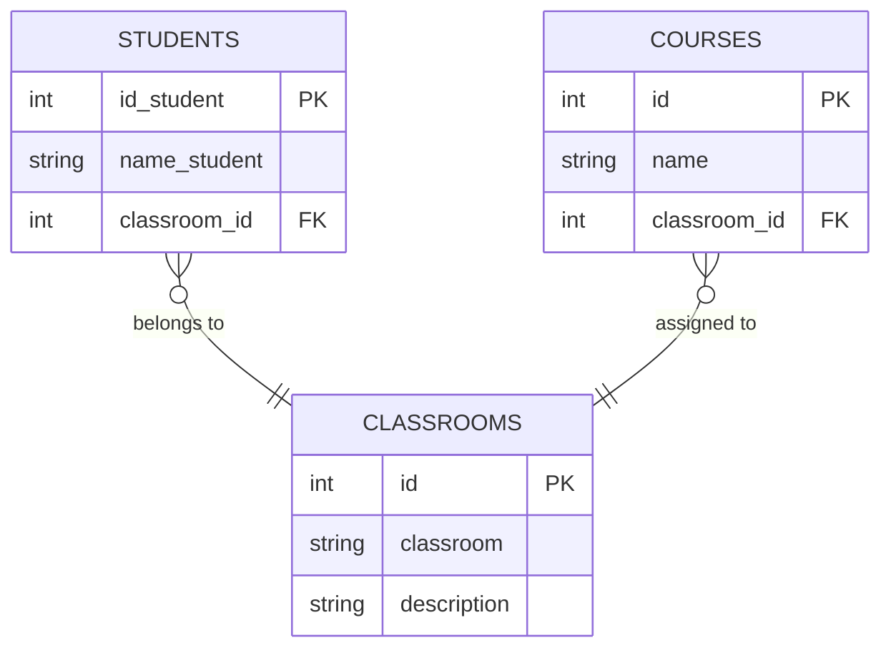

# Database Normalization — Students, Classrooms & Courses

## Description

This exercise starts from an unnormalized table containing data about students, classrooms, and courses. The goal is to apply the three normal forms (1NF, 2NF, and 3NF) to achieve a clean database design free of redundancy and transitive dependencies.

The key insight of the exercise: **courses depend on the classroom**, not on the student.

---

## Original Table (unnormalized)

| id_student | name_student | classroom | classroom_description | course1 | course2 | course3 |
|---|---|---|---|---|---|---|
| 1 | Ana Martínez | A101 | Web Frontend | HTML | CSS | JavaScript |
| 2 | Luis Fernández | A102 | Web Backend | Java | Spring Framework | SQL |
| 3 | Carla Gómez | A101 | Web Frontend | HTML | CSS | JavaScript |
| 4 | Diego López | A103 | Desarrollo Mobile | Kotlin | Swift | Dart |

### Problems identified

- `course1`, `course2`, `course3` are repeating groups → does not meet **1NF**
- `classroom_description` depends only on `classroom`, not on the student → does not meet **2NF**
- Courses depend on the classroom, not the student (transitive dependency) → does not meet **3NF**

---

## Normalization

### 1NF — Remove repeating groups

The `course1/course2/course3` column structure is removed, ensuring each field is atomic.

### 2NF — Remove partial dependencies

`classroom_description` is extracted into its own `CLASSROOMS` table (renamed to `description`), since it depends only on `classroom_id` and not on `id_student`.

### 3NF — Remove transitive dependencies

Courses are extracted into their own `COURSES` table with a FK to `CLASSROOMS`, because they depend on the classroom, not the student.

---

## Final normalized model

---

## Chen ER Diagram

---

## Crow's Foot Diagram

