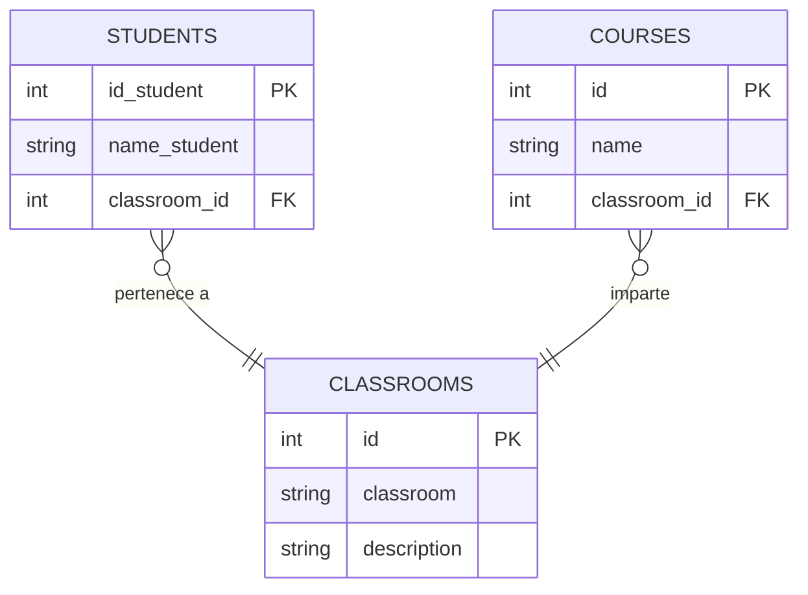

# Normalización de Base de Datos — Students, Classrooms & Courses

## Descripción

Este ejercicio parte de una tabla sin normalizar que contiene datos de estudiantes, aulas y cursos. El objetivo es aplicar las tres formas normales (1NF, 2NF y 3NF) para obtener un diseño de base de datos limpio, sin redundancias ni dependencias transitivas.

La clave del ejercicio está en esta pista: **los lenguajes de programación dependen del aula**, no del estudiante.

---

## Tabla original (sin normalizar)

| id_student | name_student | classroom | classroom_description | course1 | course2 | course3 |
|---|---|---|---|---|---|---|
| 1 | Ana Martínez | A101 | Web Frontend | HTML | CSS | JavaScript |
| 2 | Luis Fernández | A102 | Web Backend | Java | Spring Framework | SQL |
| 3 | Carla Gómez | A101 | Web Frontend | HTML | CSS | JavaScript |
| 4 | Diego López | A103 | Desarrollo Mobile | Kotlin | Swift | Dart |

### Problemas identificados

- `course1`, `course2`, `course3` son grupos de repetición → viola **1NF**
- `classroom_description` depende solo de `classroom`, no del estudiante → viola **2NF**
- Los cursos dependen del aula, no del estudiante (dependencia transitiva) → viola **3NF**

---

## Normalización

### 1NF — Eliminar grupos de repetición

Se elimina la estructura de columnas `course1/course2/course3` y se garantiza que cada campo sea atómico.

### 2NF — Eliminar dependencias parciales

`classroom_description` se extrae a su propia tabla `CLASSROOMS`, ya que depende únicamente de `classroom_id` y no de `id_student`.

### 3NF — Eliminar dependencias transitivas

Los cursos se extraen a su propia tabla `COURSES` con una FK a `CLASSROOMS`, porque dependen del aula, no del estudiante.

---

## Modelo final normalizado

---

## Diagrama ER de Chen

---

## Diagrama de Patas de Gallo

